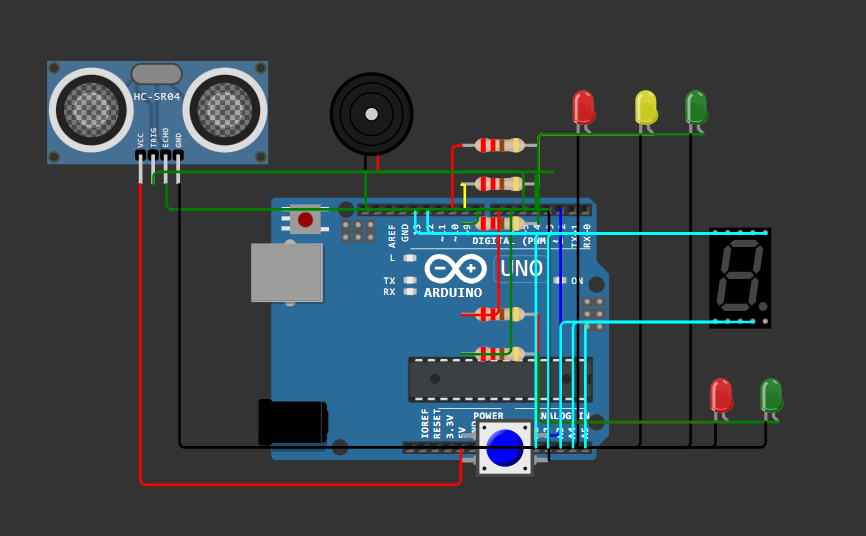

# Smart Traffic Light Controller with Pedestrian Crossing

An Arduino-based intelligent traffic signal controller that manages vehicle and pedestrian lights, dynamically adjusting pedestrian crossing priority using real-time distance detection from an ultrasonic sensor.

## Circuit Diagram

## Features
- Vehicle traffic light sequencing (Green → Yellow → Red)
- Pedestrian crossing request handling
- Ultrasonic sensor-based priority control
- Buzzer countdown feedback

## Technologies Used
C, Arduino Uno, HC-SR04 Ultrasonic Sensor

## Live Simulation (Wokwi)
Run the project online without hardware:  
[Open Simulation in Wokwi](https://wokwi.com/projects/443850609930388481)

## Project Status
✅ Completed (Mini Project)
